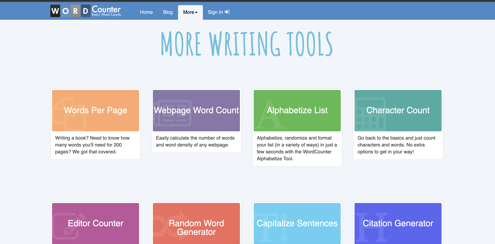
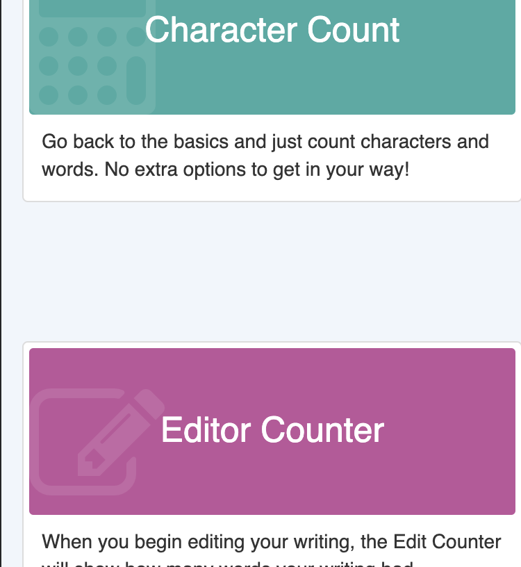
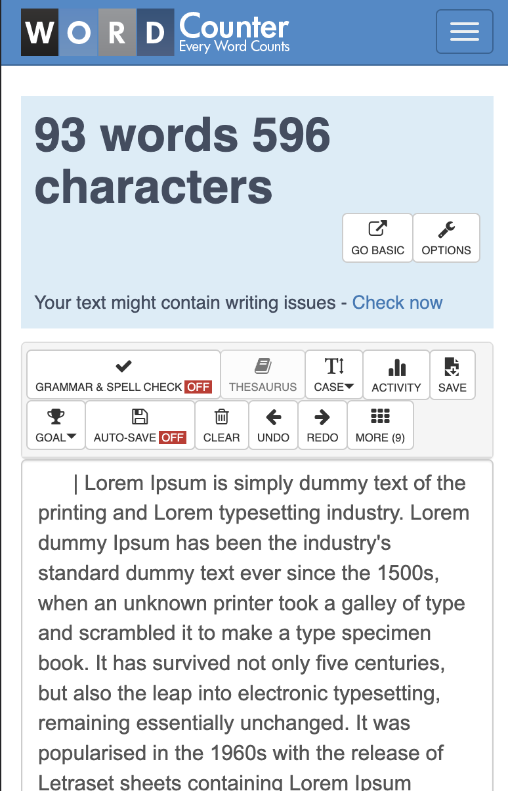
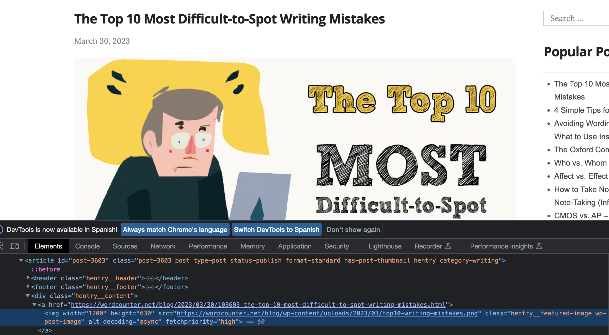
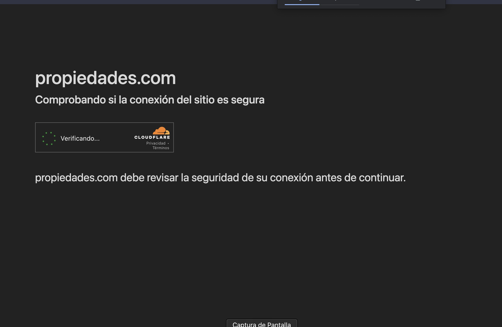
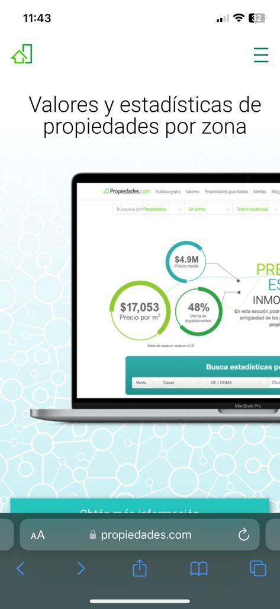
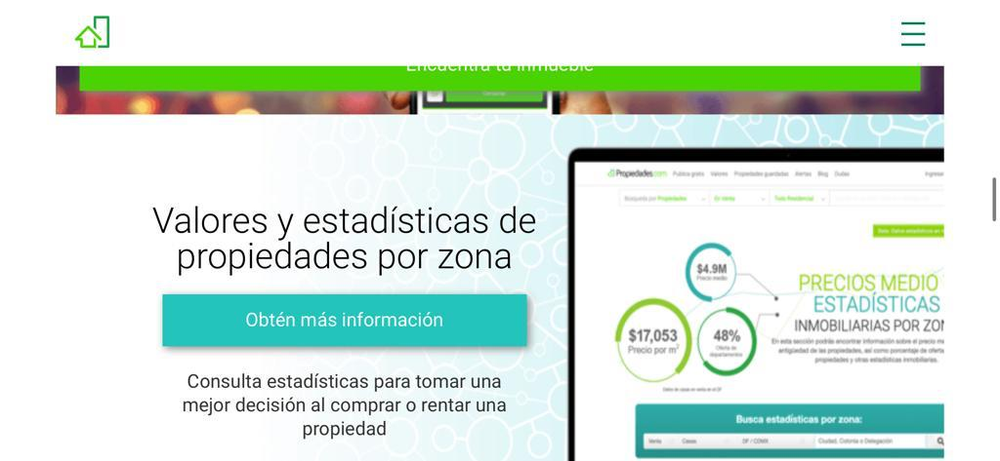
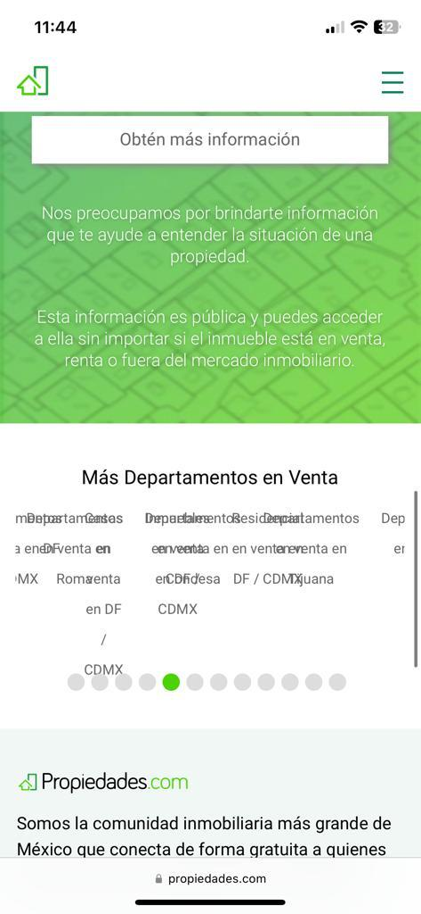
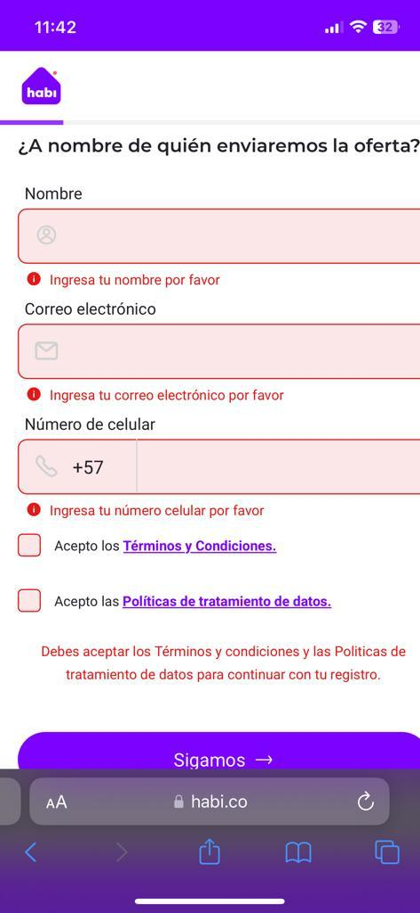
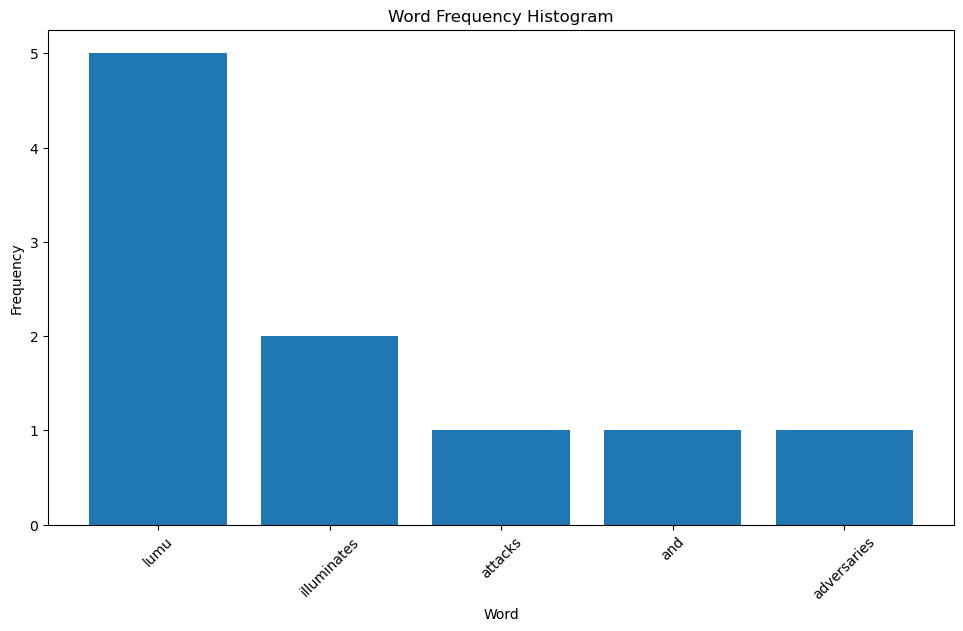

# Software Developer Engineer in Test - Test Automation Engineer


### 1. AUTOMATED TEST SUITE
Using your preferred language/framework, create a test suite that
automatically validates that [WordCounter](https://wordcounter.net/) correctly displays:
- number of words
- number of characters
- The 3 most repeated words with the number of repetitions (Keyword
Density section)

You're free to create as many scenarios as you think are necessary to cover
those three points. It's mandatory to generate a summary report showing how
many scenarios were executed, how many passed, and how many failed with it's
error description.
Requirements

- You don't need to modify any settings in the website, always use the
default settings.
- Ask as many questions you have in order to clarify the scope of your
tests. 

Feel free to contact us or be sure to detail any assumption you
made. (Limit your questions to a single mail please)
For 1st and 4rd points:

- Upload your project to a GitHub repo and share it with us. 
- Provide detailed instructions on how to run your project (preferably also in the repo).

#### 1.1. AUTOMATED TEST SUITE - SOLUTION

Lumu Technologies is a project that developed the technical test presented in the previous paragraph.

In order to use best practices, the screemplay pattern was used, creating a single test scenario that encompasses all the test cases presented in the requirements.


#### 1.2. INSTALLATION

The development should be focused on the use of **Linux** OS or **Unix** based systems, to make the installation of the dependencies effective and ensure the operation of the project in any **development**, **testing**, and **production** environment.

For **Windows** operating systems based on version **11**, the installation of the project is performed with these steps:

1. First install [Java 17](https://www.oracle.com/java/technologies/javase/jdk17-archive-downloads.html) as the base programming language of this repository, install [Maven 3.8.6](https://maven.apache.org/download.cgi) and create the environment variables for each of the above tools.
   To test the installation you should run the following commands in your preferred command terminal.
```sh
$ java --version
$ mvn --version
```

2. As this is an automation backend project developed with serenity bdd framework [Serenity](https://serenity-bdd.github.io/docs/tutorials/first_test), it is not necessary to install any extra tool, however, you should review the documentation to understand how it works.

3. ¿How to format the code?
   In the development of any project it is quite important to format the code and have a suitable linter to ensure the coding style of the programming language, in this case, Java you can execute the following command.
```sh
mvn com.spotify.fmt:fmt-maven-plugin:format
```

This will ensure that every time you save a change to a file, it is automatically formatted and as you write the code, you will have alerts that will indicate if you are meeting the specifications of the installed linter.

### 1.3. How to run the tests?

Following these steps, we can perform the execution of the test suite or a specific feature:
```sh
$ mvn clean test verify
$ mvn clean verify -Dcucumber.filter.tags=@nombreTag
```

The test results will be recorded in the **target/site/serenity/index.html** directory.

### 2. FAILURE REPORT
You can not usually build automated testing for something that you have not done good manual testing before, so it is vital that our test engineers are able to transmit ideas, listen, and report defects/failures in a clear way.
Write a short report on any findings that you may consider a defect or worth of improvement for [WordCounter](https://wordcounter.net/).

#### 2.1. FAILURE REPORT - SOLUTION
Al ingresar al sitio web [WordCounter](https://wordcounter.net/) y seleccionar la opcion **More** se puede observar que las cards que se muestran no tienen el mismo tamaño, no se encuentran alineadas y tienen un espaciado demasiado grande entre la primera y segunda seccion, como se puede observar en la siguiente imagen.


Dado lo anterior, se valido en dispositivos mobile y se evidencia que la resolucion mejora pero el espacioado entre las cards sigue siendo demasiado grande, como se puede observar en la siguiente imagen.


Teniendo en cuenta lo anterior, y al navegar por distintas sesiones se puede evidenciar que el sitio no es responsive.

Tambien, se puede visualizar que al ingresar al sitio desde dispositivos móviles o pantallas más pequeñas, se detecta que algunos elementos experimentan desbordamientos o solapamientos, lo que repercute negativamente en la usabilidad y legibilidad, como se puede observar en la siguiente imagen.


Al salir e ingresar nuevamente a la herramienta esta manteniene el texto ingresado inicialmente en el campo de texto aun despues de reiniciar el equipo, posterior a este proceso se valido si la aplicacion estaba guardando las **Cookies**, lo cual esta realizando pero no solicita autorizacion con otros sitios web, lo cual puede generar una mala experiencia de usuario.

Continuando con la validacion de la herramienta, la seleccionar la opcion de **Blog** y pasar el mouse sobre las imagenes no hay un mensaje que haga alucion a la imagen, al ingresar a las herramientas de desarrollo del navegador se puede observar que no cuentan con la etiqueta **alt** y en caso de que falle la carga de la imagen no se muestra un texto alternativo o para personas con discapacidad visual, como se puede observar en la siguiente imagen.


Por ultimo, la curva de aprendizaje de la herramienta es muy alta, ya que no cuenta con un tutorial o guia de uso.

Por ende, se suguiere implementar un sistema de diseño, que sea responsive y que cuente con un tutorial o guia de uso para que los usuarios puedan sacar el mayor provecho de la herramienta.

### 3. UX MATTERS
Usually our work as testers in a product/project starts from the design phase,
in that time we already can make comments and suggestions that allows the
Design team to make some improvements in order to have a clean final product
that matches with the client's expectations.
In this test you may search for issues in user interfaces of a public and well
known web page/application (ex. Search forms, Business flows, Payment forms).
You may build a report with 3 UX issues, give us a clear explanation about
what’s wrong and how we can replicate it.

#### 3.1. UX MATTERS - SOLUTION
Este documento tiene como objetivo documentar los incidentes encontrados dentro de la página web [Propiedades.com](https://propiedades.com/) y [Habi.co](https://habi.co), con el fin de mejorar la experiencia de usuario y la satisfacción de los mismos.

Al ingresar a la página web de [Propiedades.com](https://propiedades.com/) inicialmente se evidencia que al ingresar al sitio por primera, se muestra una panatlla de validacion de seguridad antes de mostrar el home de la misma, esto se puede visualizar en dispositivos mobiles, tablets y equipos de computo, como se puede observar en la siguiente imagen.

En ocasiones se debe diligenciar el captcha para poder ingresar a la página, lo cual puede generar una mala experiencia de usuario, ya que se puede generar una pérdida de tiempo y de usuarios.

Sugerencia: Se sugiere que se implemente un sistema de seguridad que no sea tan invasivo para el usuario.


Posteriormente, se muestra la pantalla de home de [Propiedades.com](https://propiedades.com) desde un dispostivo mobile (para este caso un iphone 12)  se visualiza que la página no es responsive puesto que la imagen del equipo de computo donde estan las graficas esta cortada, lo cual genera una mala experiencia de usuario, como se puede observar en la siguiente imagen.


Dando continuidad al punto anterior, se cambio la pantalla a modo horizontal y aunque se puede visualizar la imagen un poco mas clara sigue sin mostrarse completa, como se puede observar en la siguiente imagen.


Por otro lado, al dar scroll hasta la seccion **Mas departamentos en Venta**, mover para ver mas zonas, a partir del segundo scroll de evidencia que el texto de empieza a sobre poner, lo cual dificulta la visibilidad de la informacion, como se puede observar en la siguiente imagen.


Por ultimo, al cambiar de secciones desde un equipo de escritorio se visualiza que se estan realizando cambios en el sistema de diseño de la pagina, por ejemplo en la seccion de bienvenida se muestra un diseño diferente al de la seccion de **Publicar gratis**, como se puede observar en la siguiente imagen.
%2012.27.01%20p.m..png)

Pero al visualizar la siguiente imagen se puede observar que los colores empiezan a diferir un poco.
%2012.27.38%20p.m..png)

Sugerencia: Se sugiere que se implemente un diseño igual para todo el sitio y que sea responsive para que se pueda visualizar correctamente en dispositivos móviles, puesto que este sitio cuenta con un trafico de aproximadamente 2 millones de usuarios pero no se esta monetizando si no el uno 1%.

Por otro lado, al ingresar a la página de [Habi.co](https://habi.co) se evidencia que la página no es responsive, lo cual genera una mala experiencia de usuario, ya que no se puede visualizar correctamente en dispositivos móviles, como se puede observar en la siguiente imagen.



### 4. WORD FREQUENCY COUNTER
Knowing how often a word appears in a sentence or block of text is helpful for
several types of word analysis.
Using your preferred language/framework, create your own algorithm that reads
a text file and counts the frequency of words in the given text. Then it
counts words and characters, and also constructs a histogram displaying the
words and the frequency.
Example Output.
Given a file with the text below
lumu lumu lumu lumu lumu illuminates illuminates attacks and adversaries

#### 4.1. WORD FREQUENCY COUNTER - SOLUTION

To give solution to the previous point a book with **.ipynb** extension was created, if you want to run it inside your environment you must create a file with the above mentioned extension and run, using the jupyter notebook environment.
The code is shown below, which is stored in the folder **Word Frequency Histogram** together with the **.txt** file used for the exercise.

```python
import re
from collections import Counter
import matplotlib.pyplot as plt
```

```python
class ReadFile:
    
    def read(self) -> str:
        with open('LumuTechnologies.txt', 'r') as file:
            return file.read()
```

```python
data = ReadFile()
data.read()
```

```python
class CounterWordCharacter:
    data = ReadFile()
    top_n = 10

    def token(self):
        return re.findall(r'\b\w+\b', self.data.read().lower())

    def word_frequency(self) -> Counter[Any]:
        return Counter(self.token())

    def words(self):
        return len(self.token())

    def characters(self):
        return len(self.data.read())

    def common_words(self):
        return self.word_frequency().most_common(self.top_n)
```

```python
class CreateHistogram:

    word = CounterWordCharacter()

    def histogram(self):
        plt.figure(figsize=(10, 6))
        plt.xlabel('Word')
        plt.ylabel('Frequency ')
        plt.title('Word Frequency Histogram')
        plt.xticks(rotation=45)
        plt.tight_layout()
        plt.bar(*zip(*self.word.common_words()))
        plt.show()
```

```python
word = CounterWordCharacter()
print(word.words())
print(word.characters())
print(word.common_words())
print(word.token())
print(word.word_frequency())
print(word.common_words())
histogram = CreateHistogram()
histogram.histogram()
```

Below is the result when executing the code in a python environment.

